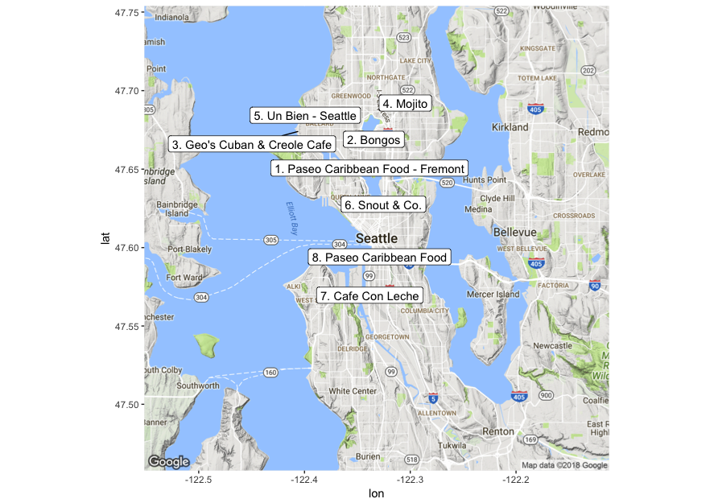

# `APIs` in Action: Finding Cuban Food in Seattle

This section uses the [Yelp Fusion API](https://www.yelp.com/developers/documentation/v3) to answer the question:

> _“Where is the best Cuban food in Seattle?”_

In doing so, it demonstrates how to request data from an API, and process/analyze the results of that request. Using 

**Note**: You will need to obtain two API Keys in order to run [the code](analysis.R): one from the [Yelp API](https://www.yelp.com/developers/documentation/v3/authentication), and another from the [Google Maps API](https://developers.google.com/maps/documentation/geocoding/get-api-key). Once you have obtained these keys, we suggest you save them in the [api_key.R](api_key.R). 

This project uses the results from the Yelp API to generate the following map of Cuban restaurants in Seattle (which will reflect the _current_ ratings on Yelp, and so may differ from the book):

