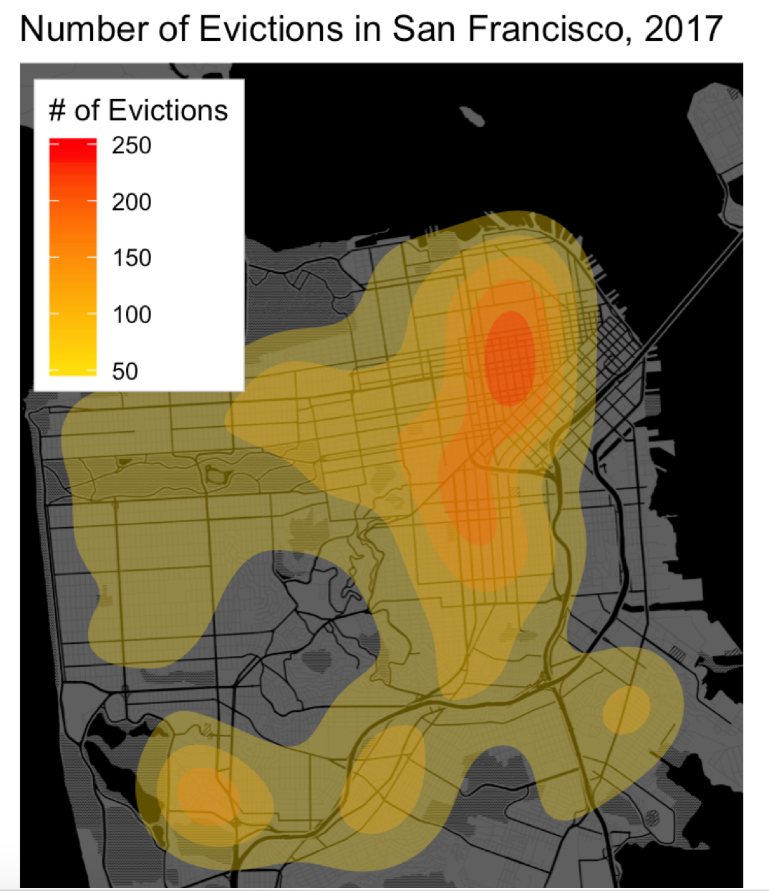

# `ggplot2` in Action: Mapping Evictions in San Francisco

This section visualizes [eviction notice data](https://catalog.data.gov/dataset/eviction-notices) to help better understand tenant rights in San Francisco

**Note**: You will need to obtain an API Key from the [Google Maps API](https://developers.google.com/maps/documentation/geocoding/get-api-key) in order to run [the code](analysis.R). Once you have obtained these keys, we suggest you save them in the [api_key.R](api_key.R). 

Amongst other visualizations, the [code](analysis.R) generates the heatmap below, expressing the concentration of eviction notices filed in the city.

