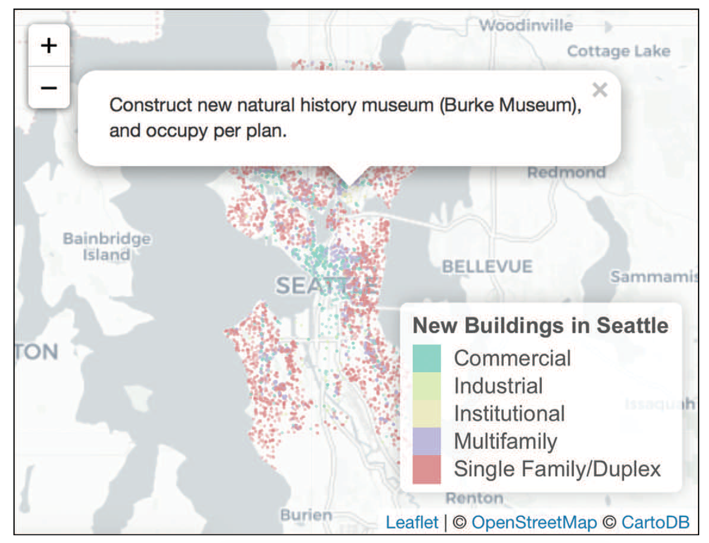

# Interactive Visualization in Action: Exploring Changes to the City of Seattle

This section uses publicly available [building permit data]( https://data.seattle.gov/Permitting/Building-Permits/76t5-zqzr) to identify patterns in the physical changes to the city of Seattle. In doing so, it demonstrates usage of the interactive visualization packages [Plotly](https://plot.ly/r/) and [Leaflet](https://rstudio.github.io/leaflet/) to create representations of the data such as this one:

