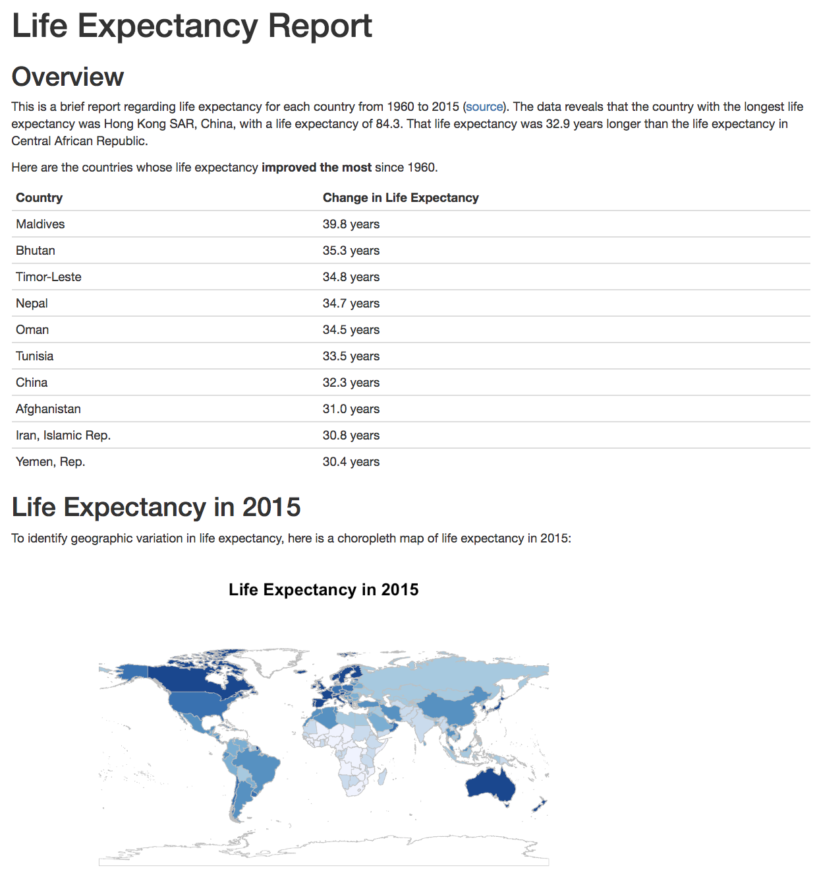

# R Markdown in Action: Reporting on Life Expectancy

This section walks through authoring a report about the life expectancy in each country from 1960 to 2015. The data for the example can be downloaded from the [World Bank](https://data.worldbank.org/indicator/SP.DYN.LE00.IN) website. In doing so, it demonstrates techniques for generating documents that can be shared on the web.

To keep the code organized, the report is written in two separate files:
 
- [`analysis.R`](analysis.R), which performs the analysis, and save important values in variables
- [`index.Rmd`](index.Rmd), which uses the `source()` method to load the `analysis.R` script and generate the report (the file is
named so that it can be hosted on GitHub Pages when rendered)

Using the `knit()` function in `R`, this code generates a report as an [`index.html`](index.html) file, a screenshot of which is shown below.

