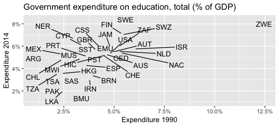
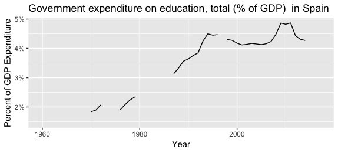
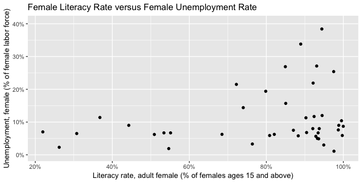

# `tidyr` in Action: Exploring Educational Statistics

This section uses a real data set to demonstrate how reshaping your data with `tidyr` is an integral part of the data exploration process. The [data](data/) in this example was downloaded from the [World Bank Data Explorer](https://data.worldbank.org/), which is a data collection of hundreds of indicators (measures) of different economic and social development factors. In particular, this example considers [educational indicators](http://datatopics.worldbank.org/education/) that capture a relevant signal of a country’s level of (or investment in) education— for example, government expenditure on education, literacy rates, school enrollment rates, and dozens of other measures of educational attainment. 

In exploring the data through different lenses, the [code](analysis.R) generates the following figures to make comparisons between countries and over time:

## Comparing educational expenditure in 1990 and 2014 (by country)

## Evaluating the expenditure over time in a particular location (Spain)

## Comparing female literacy and unemployment rates (by country)

